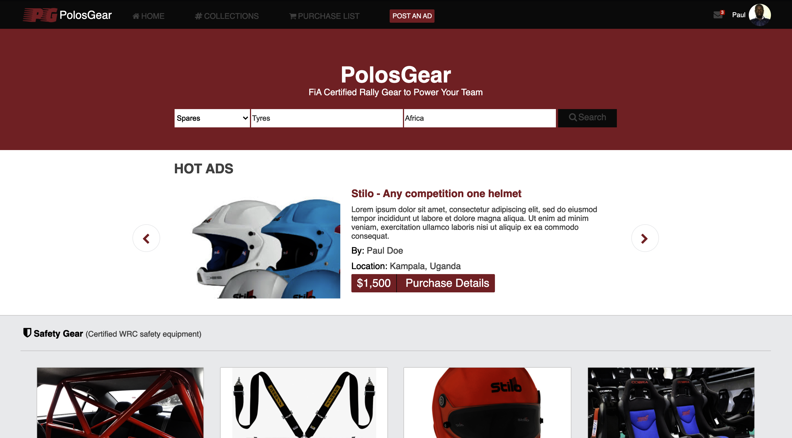
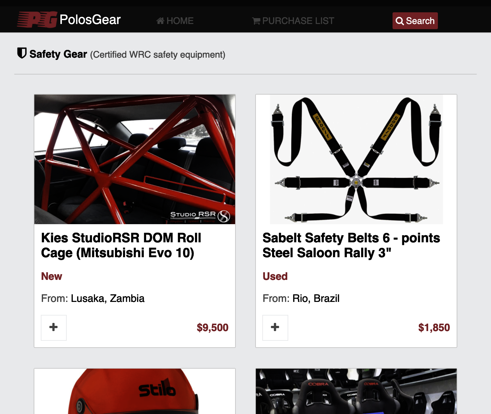
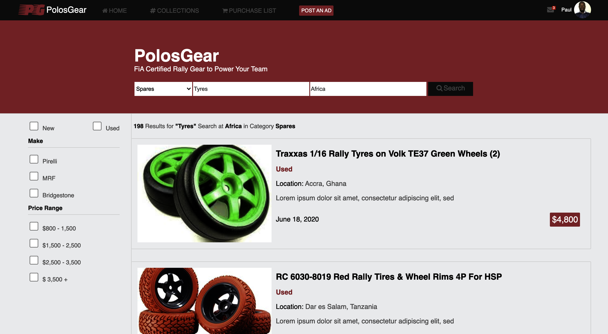
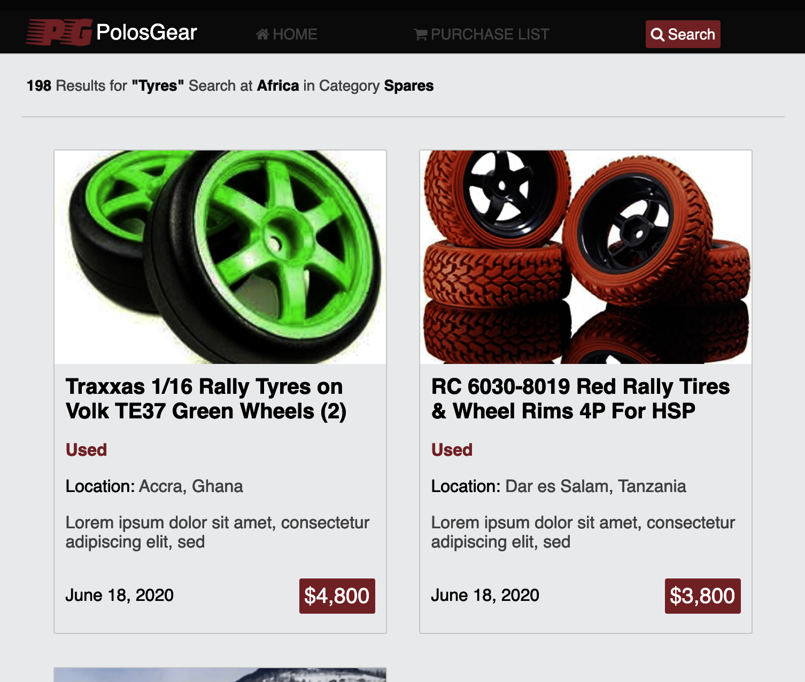

# PolosGear-Rallying

This is a concept for an online market place where motor rallying teams can go to buy or hire
materials, tools and equipment that they need to succeed in a rallying competition.

It is submitted as my capstone project for the Microverse HMTL/CSS curriculum.

## Screenshots

| Desktop / Tablet                                    | Mobile                                                     |
| --------------------------------------------------- | ---------------------------------------------------------- |
|     |            |
|  |  |

## Built With

- HTML & CSS3,
- FlexBox, Grid

## Live Demo

[Live Demo Link](https://raw.githack.com/pbkabali/PolosGear-Rallying/search-and-results-pages/html/index.html)

## Getting Started

To get a local copy up and running follow these simple example steps.

### Prerequisites

- Web Browser

### Setup

`$git clone https://github.com/pbkabali/PolosGear-Rallying.git`

### Install

- Run a local server

### Usage

- Personal Project - HTML Capstone Project

## Author

👤 **Paul Balitema Kabali**

- Github: [@pbkabali](https://github.com/pbkabali)
- Twitter: [@pbkabali](https://twitter.com/pbkabali)
- Linkedin: [engineerbpk](https://linkedin.com/in/engineerbpk)

## 🤝 Contributing

Contributions, issues and feature requests are welcome!

Feel free to check the [issues page](https://github.com/pbkabali/PolosGear-Rallying/issues).

## Show your support

Give a ⭐️ if you like this project!

## Acknowledgments

- [Mohammed Awad on Behance](https://www.behance.net/M_Awad)
- Microverse Team 140 (The Cupids)
- [Font Awesome Icons](https://fontawesome.com)

## 📝 License

This project is [MIT](lic.url) licensed.
